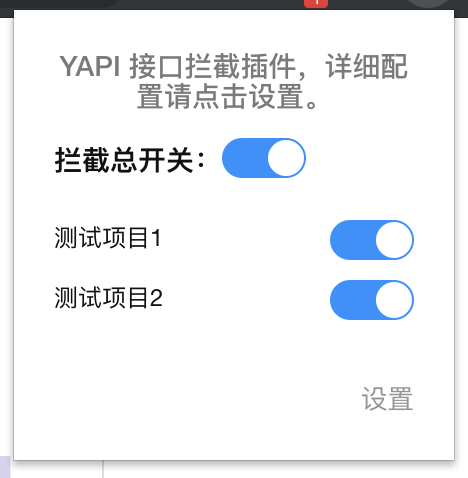
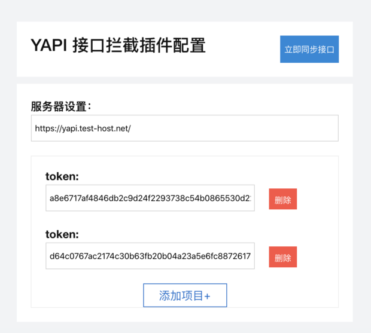
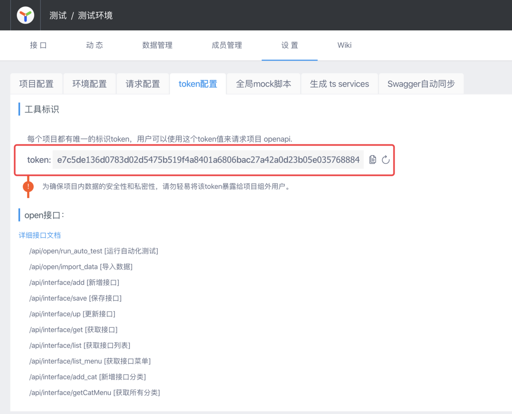

# yapi-mock-plugin 


- [英文](README.md)

## 截图





## 功能
  - 不需要手动修改代码,不需要任何中间技术支持，完成Mock 
  - 从yapi上自动同步接口，不需要再次重新定义 
  - 通过开关开启关闭接口mock，方便切换mock数据与线上数据
  
## 安装
### 下载

你可以自行下载和构建源码，也可以下载下面已经构建好的代码

- [YAPI Mock Plugin Download Page  (GitHub release)](https://github.com/JackyTianer/yapi-mock-chrome-plugin/releases)

### 谷歌商店
你也可以在谷歌商店里面直接下载插件使用 [link](https://chrome.google.com/webstore/detail/hmilbnjkdfelpikedbjhcdbpbjdfphnl)

## 怎么使用
- 当安装完插件后，在弹窗上点击设置按钮
- 输入你的yapi服务器地址
- 在你的项目里面找到`token`, 可以在项目的token配置中找到它
  
- 点击添加项目，并把刚才的token输入进去
- 点击立即同步按钮，当弹窗提示成功时你就可以愉快的mock了

## 本地开发运行和编译

### 环境
 - 安装 [Node.js](https://nodejs.org/)
 - 进入`./`目录，执行 `npm install` 安装所需要的依赖
    ```bash
    npm install
    ```
    
### 运行
  - 进入`./`目录，执行 `npm run chrome-watch` 来监听文件变化（你也可以执行`npm run firefox-watch`）   
  - 打开 chrome/opera 浏览器，输入chrome://extensions
  - 选中“开发者模式”，然后点击 “加载已解压的拓展程序” 
  - 在文件选择框中，选择 `YAPI-mock-plugin/build/chrome` 或者 (`YAPI-mock-plugin/build/opera`)
  
### 开发
  
  当您要开始开发扩展并希望启用实时重载时，可以使用以下任务： 
  - `npm run chrome-watch`
  - `npm run opera-watch`
  - `npm run firefox-watch`

### 打包
  执行 `npm run dist` 来创建压缩包, 每个浏览器的插件生成完毕后，可以将其上传到应用商店。


## Copyright
This project is licensed under the MIT license.

-----------
如果你有任何问题，请创建issure,我很高兴能听到大家的想法和意见


